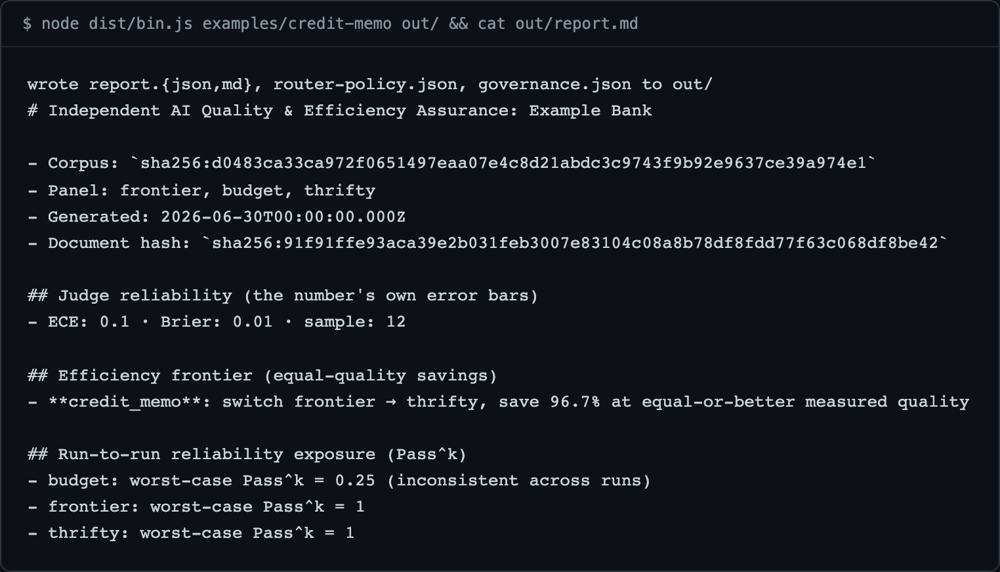

<div align="center">

<picture>
  <source media="(prefers-color-scheme: dark)" srcset="docs/assets/banner-dark.svg">
  
</picture>

<p>error bars for LLM-as-judge evals</p>

<p>
  <a href="https://www.npmjs.com/package/@apatureai/sigil"></a>
  <a href="https://github.com/apatureai/sigil/actions/workflows/ci.yml"></a>
  <a href="LICENSE"></a>
</p>

<p>Part of the <a href="https://github.com/apatureai">Apature stack</a> - automated design review for rendered UI. The <a href="https://github.com/apatureai/.github/blob/main/profile/README.md">org profile</a> maps how the pieces compose.</p>

</div>



If you use a model to grade another model's output, you have a ruler you have never measured; sigil
measures it - calibration, finite-sample risk certificates, and drift monitoring, in dependency-free
TypeScript. It calls no model, holds no key, and opens no socket: you supply the judge's verdicts and
the human labels, sigil scores them and emits a byte-reproducible report with the numbers' own error
bars attached.

- People running LLM-as-judge eval pipelines in Node who need calibration with error bars, not a single accuracy figure.
- Anyone shipping selective prediction who wants an abstention threshold with a finite-sample guarantee attached.
- Teams doing model-cost work who need "switch to the cheaper model" to be an evidenced claim, not a comparison of two averages.
- JS/TS people locked out of the conformal-prediction and e-process stats ecosystem, which is almost entirely Python and R.

## Quickstart

Node 24 or newer and pnpm 9 or 10. No credentials, no API keys, no network: sigil reads no
environment variables at all. If pnpm is missing, `corepack enable pnpm` ships with Node.

```
pnpm install --frozen-lockfile
pnpm build
node dist/bin.js examples/credit-memo out/ && cat out/report.md
```

`pnpm build` is not optional: `tsconfig.json` sets `noEmit: true`, so the CLI runs from the emitted
`dist/`. If `node dist/bin.js` reports `Cannot find module`, you skipped it.

`examples/credit-memo/` is a complete synthetic input bundle - a frozen corpus with human labels, a
captured three-model panel run, and captured judge verdicts. The run prints the report shown above
and writes four files to `out/`:

```
wrote report.{json,md}, router-policy.json, governance.json to out/
```

**Success criterion:** the document hash printed in the report is exactly
`sha256:91f91ffe93aca39e2b031feb3007e83104c08a8b78df8fdd77f63c068df8be42`. That hash is
content-addressed over the whole report, so matching it means your run reproduced the audit byte for
byte.

## What you get

Four files land in `out/`, and nothing raw crosses into them - the egress guard runs before anything
is written:

| File | Bytes | Contents |
|---|---|---|
| `report.md` | 719 | The human-readable audit: judge reliability, the equal-quality frontier, Pass^k reliability |
| `report.json` | 854 | The same content structured, ending in `documentHash` |
| `router-policy.json` | 175 | A vendor-neutral `neutral-route/1` policy: per family, the cheapest model clearing `qualityFloor` |
| `governance.json` | 218 | The least-privilege overlay: agents holding scopes no observed task requires |

The numbers are the point of the exercise:

- `budget` costs 10x less than `frontier`, but it failed one of its four recorded runs, so its Pass^3
  collapses to `0.25`. It is **not** recommended, and the cost delta does not rescue it.
- `thrifty` held quality exactly at 1/30th the cost of `frontier` - `save 96.7% at equal-or-better
  measured quality`. That is the recommendation, exported to `router-policy.json`.
- `ECE: 0.1` is reported *before* any savings claim. A badly calibrated judge shows up first, rather
  than being used as a broken ruler to sell you a saving.
- The raw task input (`Summarize creditworthiness for applicant 4821`) and the raw model outputs
  appear in none of the four files.

## Usage

### CLI

```
node dist/bin.js <bundle-dir> [out-dir]
```

`out-dir` defaults to `<bundle-dir>/out`. Exit code `0` on success, `2` with a usage message when
`<bundle-dir>` is omitted, `1` on any failure - including an egress violation, a bundle asking for
more trials than it captured, or a `passK` larger than the recorded runs, in which case the CLI
writes nothing at all (see [Failure modes](docs/failure-modes.md)). The package is not yet installable
from npm; invoke the built entry point directly.

A bundle directory holds four required JSON files and one optional one. To audit your own system,
copy `examples/credit-memo/` and replace the contents:

| File | Required | Contents |
|---|---|---|
| `config.json` | yes | Run configuration; see [Configuration](#configuration) |
| `corpus.json` | yes | `{ rubric, tasks[] }`; every task carries human `labels` of `{ output, accept }`. The frozen, content-addressed benchmark set; an unlabeled output is conservatively treated as not-accepted |
| `panel.json` | yes | The captured panel run, per model: `{ costUsd, latencyMs, outputs: { [taskId]: string[] } }`. One array entry per distinct recorded trial, so run-to-run variance is expressible |
| `judge.json` | yes | Judge verdicts keyed by raw output string: `{ pass, confidence }`. An output with no verdict is treated as `{ pass: false, confidence: 0.5 }` |
| `governance.json` | no | `{ agents[], requirements[] }` for the least-privilege overlay. Omit it and the overlay returns `[]` |

### As a library

The same audit runs through the API. The core call, from the full runnable example in
[docs/api.md](docs/api.md):

```ts
import { freezeCorpus, panelCorpus, groundTruthFrom, runAudit, StubGateway } from "./dist/index.js";

const frozen = freezeCorpus(corpus);            // -> content-addressed
const report = await runAudit({
  corpus: panelCorpus(frozen), models: ["frontier", "budget", "thrifty"],
  gateway: new StubGateway(panel),              // a captured panel run, per trial
  judge, groundTruth: groundTruthFrom(frozen),
  trialsPerTask: 4, passK: 3, currentModel: "frontier",
});
```

`buildReportDocument(report, ...)` renders the same content-addressed document as the CLI - the same
frozen corpus plus the same frozen panel produces a byte-identical `documentHash`, whichever entry
point you use. The complete file, with its real captured output, is in [docs/api.md](docs/api.md).

## Configuration

Sigil reads **no environment variables**. All configuration is the `config.json` in the bundle:

| Field | Required | Effect |
|---|---|---|
| `client` | yes | Name printed in the report header |
| `models` | yes | The candidate panel; must match the keys in `panel.json` |
| `trialsPerTask` | yes | How many recorded trials per task to consume. It may not exceed the shortest series in `panel.json`; the CLI refuses the bundle rather than repeat a recorded output ([why](docs/failure-modes.md#asking-for-more-trials-than-were-captured)) |
| `passK` | yes | The `k` in Pass^k. It may not exceed `trialsPerTask`, because the estimator needs at least `k` observed runs; the CLI refuses the bundle rather than leave the pairs unmeasured ([why](docs/failure-modes.md#asking-for-a-passk-the-capture-cannot-answer)) |
| `currentModel` | yes | The incumbent the switch recommendation is measured against |
| `qualityFloor` | yes | Minimum measured quality a model must clear to be the primary route in the exported policy |
| `generatedAt` | yes | ISO timestamp recorded in the report. Supplied rather than read from the clock, so runs stay byte-identical |

## What it does not do

- It does not include an LLM judge. `Judge` is an interface; you supply the judge and the human
  labels, sigil scores them.
- It does not call a model, hold a key, or open a network socket in the analysis path. The panel run
  is captured upstream and supplied as data.
- It does not route traffic, edit code, or mutate anything on your estate. Every artifact it produces
  is derived facts only.
- It is not a scheduler or a service. See the [roadmap](docs/roadmap.md).

## Design notes

The long-form design essays moved to `docs/` verbatim; each answers one question.

- [docs/design-notes.md](docs/design-notes.md) - why an unqualified number is not evidence, and the nine design decisions that follow (measured measurement, finite-sample guarantees, anytime-valid monitoring, evidence-gated headlines, determinism, fail-closed egress, signed artifacts).
- [docs/how-it-works.md](docs/how-it-works.md) - the pipeline over injected ports, the boundaries enforced in code, deployment modes, the per-module directory map, and documented failure modes.
- [docs/api.md](docs/api.md) - the complete runnable library example and its real captured output.
- [docs/failure-modes.md](docs/failure-modes.md) - what happens when a bundle asks for more trials, or a higher Pass^k, than the capture can answer.
- [docs/roadmap.md](docs/roadmap.md) - Working / Partial / Planned status, out-of-scope decisions, and the stated statistical preconditions.
- [docs/development.md](docs/development.md) - how to regenerate the banners and the hero image.

## Status

Everything the quickstart exercises works today: calibration metrics, risk certificates
(Clopper-Pearson, Learn-Then-Test, property-tested), Pass^k with a certified floor, the Pareto
frontier and McNemar switch gate, the four written artifacts, the signed bundle, and the egress
guard. The live OpenAI-compatible gateway adapter is implemented and unit-tested against an injected
`fetch` but unverified against a real endpoint (Partial). Continuous/trend mode, external
cross-validation of `drift.ts`, and npm publication are Planned. Full detail, described as real gaps,
in [docs/roadmap.md](docs/roadmap.md).

## Prior work

The statistical machinery follows published lines rather than inventing any: split conformal
prediction and Learn-Then-Test risk control (Angelopoulos, Bates et al.); selective classification
with a reject option (Geifman and El-Yaniv); betting supermartingales and e-detectors (Waudby-Smith
and Ramdas; Shin, Ramdas and Rinaldo, arXiv:2203.03532); adaptive conformal inference under
distribution shift (Gibbs and Candes, NeurIPS 2021); Page's CUSUM; the exact McNemar test;
Clopper-Pearson intervals. The contribution here is putting them behind one deterministic,
reproducible, fail-closed audit contract in TypeScript, not the estimators themselves.

## Development

```
pnpm install --frozen-lockfile
pnpm typecheck   # tsc --noEmit
pnpm test        # vitest run -> 23 files, 192 tests, ~2s
pnpm lint        # eslint .
pnpm build       # tsc -p tsconfig.build.json -> dist/
```

Those five commands, in that order, are exactly what CI runs (`.github/workflows/ci.yml`); all five
pass on a clean checkout (verified 2026-08-24, Node 24.14.0, pnpm 10.34.3). Sigil is offline and
deterministic by construction and the tests enforce it: no test may call a real model, key, or
network, and no wall clock or RNG lives in the analysis path.

## Contributing

Issues and pull requests are read; the [roadmap](docs/roadmap.md) is the shortlist. See
[CONTRIBUTING.md](CONTRIBUTING.md) for setup, conventions, and review.

## Security

No credentials, keys, or secrets are stored in this repository, and the analysis path opens no
sockets. Report a vulnerability via GitHub's private vulnerability reporting; [SECURITY.md](SECURITY.md)
has the policy and the threat boundary.

## License

MIT - see [LICENSE](LICENSE).
